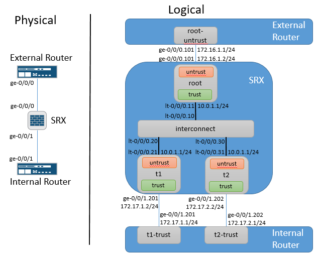

# Junos-LSYS-Interconnect
An Ansible playbook to automatically generate and/or deploy Junos external router, SRX LSYS & internal router configurations used to test the LSYS with Inter
connect at scale. This playbook only generates the interface & routing instance configurations for the internal and external routers and the LSYS configurati
on on the SRX. That means you have to manually configure all other aspects of those devices.

# Diagram

# Editing the Master variables file
There arent configuration entries for the interconnect LSYS because the lt- interfaces and routing instance is automatically generated based on the number of
 user LSYS defined in the lsys_members dictionary.

# Running Playbook
1. Update master-vars.yml file with specifics for your network
2. a. Build configs & test NETCONF: ansible-playbook -i inventory build.yml
2. b. Build configs & deploy: ansible-playbook -i inventory build_deploy.yml
3. Generated configs are in the ./Configs directory

