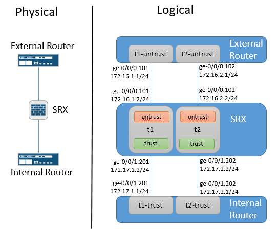

# Junos-LSYS-Config-Gen
An Ansible playbook to automatically generate Junos external router, SRX LSYS & internal router configurations used to test the LSYS feature at scale. This playbook only generates the interface & routing instance configurations for the internal and external routers and the LSYS configuration on the SRX. That means you have to manually configure all other aspects of those devices.

# Diagram

# Running Playbook
1. Update master-vars.yml file with specifics for your network
2. ansible-playbook -i inventory build.yml
