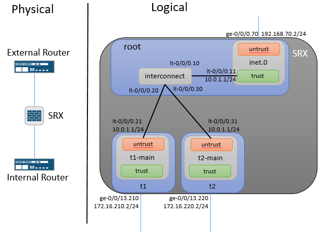

# Junos-LSYS-Interconnect
An Ansible playbook to generate and/or deploy Junos external router, SRX Tenants & internal router configurations used to test the Tenants with interconnect at scale. This playbook generates the interface & routing instance configurations for the internal and external routers and the Tenant configuration for the SRX. OSPF is configured between the root trust interface and the untrust interface of all tenants.

# Diagram

# Editing the Master variables file
There arent configuration options for the interconnect routing instance and lt-0/0/0 interfaces because those entries are generated  automatically based on the number of tenants defined in the lsys_members dictionary.

# Prerequisite SRX Configuration
1. 'set system services netconf ssh'
2. 'set security zones security-zone <zone> host-inbound-traffic system-services netconf' if managing via non-fxp0 interface
3. Same Local user account & password on all devices. (The playbook will prompt for username/password.)

# Running Playbook
1. Update master-vars.yml file with specifics for your network
2. a. Build configs & test NETCONF: ansible-playbook -i inventory build.yml
2. b. Build configs & deploy: ansible-playbook -i inventory build_deploy.yml
3. Generated configs are in the ./Configs directory

