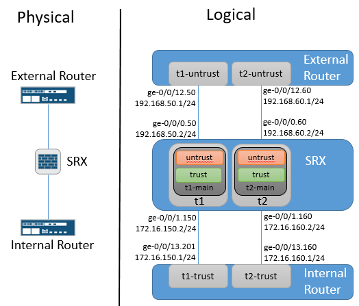

# Junos-Tenants
An Ansible playbook to generates Junos external router, SRX Tenants & internal router configurations used to test the Tenant feature at scale. This playbook only generates the interface & routing instance configurations for the internal and external routers and the Tenant configuration on the SRX. The configuration for the root system remains untouched and should be in place prior to deploying these generated configurations.

# Diagram

# Change Log
- 3Jan19: Updated Tenant interface configuration to be Junos 18.4 compliant.

# Prerequisite SRX Configuration
1. 'set system services netconf ssh'
2. 'set security zones security-zone <zone> host-inbound-traffic system-services netconf' if managing via non-fxp0 interface
3. Same Local user account & password on all devices. (The playbook will prompt for username/password.)

# Running Playbook
1. Update master-vars.yml file with specifics for your network
2. Update the inventory file with IP addresses of your routers & firewall
3. a. Generate configurations: ansible-playbook build.yml
3. b. Generate & deploy configurations: ansible-playbook -i inventory build_deploy.yml
4. Configurations stored in the Config directory
